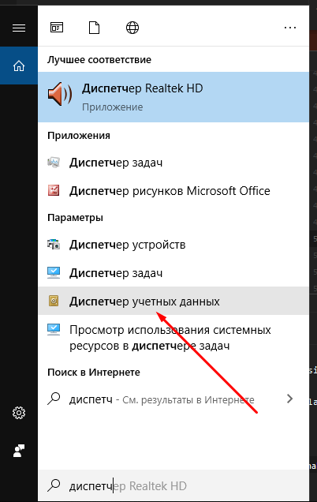
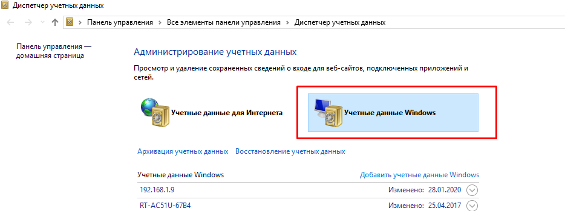
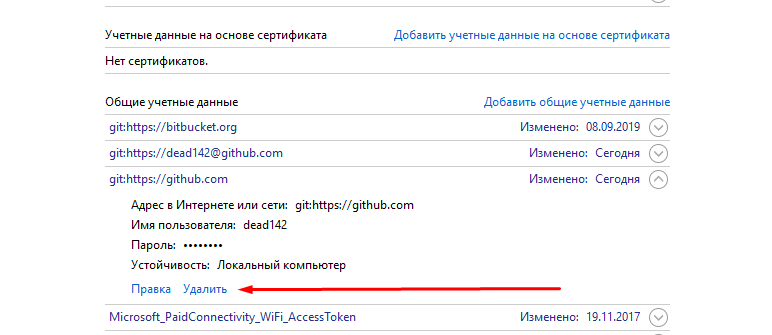

# КЕЙС (СИТУАЦИОННОЕ ЗАДАНИЕ)

**По теме:** «Система контроля версий»

**Цель работы:** закрепление практических навыков работы с основными понятиями и командами системы контроля версий git.

**Формируемые компетенции:** ПК5.1 Собирать исходные данные для разработки проектной документации на информаци-онную систему. ПК 5.2 Разрабатывать проектную документацию на разработку информационной системы в соответствии с требованиями заказчика. ПК 5.4 Производить разработку модулей информационной системы в соответствии с техническим заданием. ПК 5.6 Разрабатывать техническую документацию на эксплуатацию информационной системы

### Задания:

+ Пройти регистрацию на GitHub или GitLab или Bitbucket.
+ Создать репозиторий, в качестве имени которого будут выступать номер группы и инициалы. Пример для студента группы 286, Петрова Петра Петровича имя репозитория будет выглядеть как: «286-PetrovPP.»
+ Переименовать папки, в которых содержатся задания, по шаблону: <номер работы>_<вид работы>.

    Примеры: «1_lab», «2_task», «3_case». Где:
        – lab – лабораторная работа;
        – task –задача;
        – case – кейс.

    Таким образов, структура репозиотрия может быть представлена как:

```
– Репозиторий «286-PetrovPP»
	– 1_task
        index.php
    – 2_task
	    index.php
    ……………
    – 8_task
        index.php
        about.php
```

+ Добавить папки в репозиторий и отправить их в удаленный репозиторий.
+ В качестве отчета, прислать на почту beregkov@spb-rtk.ru письмо со ссылкой на репозиторий.
Тема письма оформляется по шаблону: <номер группы> <ФИО> <Название работы>. **Пример темы: 286 Петров П.П. Кейс №1**.
Просьба в подписи к письму писать ФИО полностью.


### Методические материалы и помощь
1. Для инициализации репозитория перейдите в папку с проектом (команда cd) выполните команду ```git init```
2. Для добавления файлов выполнить команду ```git add .```
3. Для фиксации изменения выполняется команда ```git commit -m "Name of commit"```
4. Указание пути к удаленному репозиторию осуществляется командой ```git remote add origin https://github.com:nicothin/test.git```
5. Отправка в удалённый репозиторий ```git push origin master```
Еще больше команд вы найдете здесь: [https://github.com/nicothin/web-development/tree/master/git](https://github.com/nicothin/web-development/tree/master/git)

### Ошибка при push


1) Открыть "Диспетчер учетных данных"



<p id="text-center">Рисунок 1 – Диспетчер учетных данных</p>

2) Перейдите на вкладку "Учетные данные windows"



<p id="text-center">Рисунок 2 – Учетные данные windows</p>

3) Удаление данных предущего пользователя GitHub



<p id="text-center">Рисунок 3 – Удаление данных предущего пользователя GitHub</p>

## Шкала оценивания и критерии оценки

| Оценка  | Критерии оценивания выполнения задач (домашнего задания) |
| :------------- | ------------- |
| 5  | Ход решения верный, все его шаги выполнены правильно, сообщение коммита имеет смысл  |
| 4  | Ход решения верный, все его шаги выполнены правильно, но допущена ошибка при выполнение коммита или сообщение коммита не имеет смысла  |
| 3  | Ход решения верный, задание решено не полностью  |
| 2  | Другие случаи, не соответствующие указанным критериям  |


