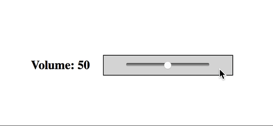
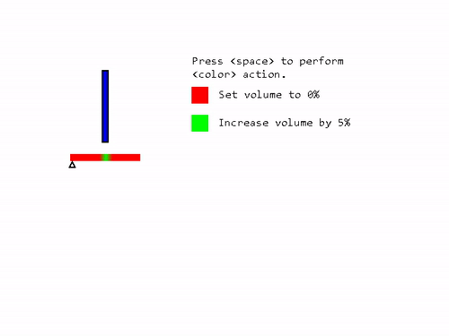

# Требования к интерфейсу пользователя

**Графический интерфе́йс пользователя**, графический пользовательский интерфейс (ГПИ) (англ. graphical user interface, GUI) — разновидность пользовательского интерфейса, в котором элементы интерфейса (меню, кнопки, значки, списки и т. п.), представленные пользователю на дисплее, исполнены в виде графических изображений. Также называется графической оболочкой управления.

Проектирование графического интерфейса пользователя (GUI — Graphical User
Interface) представляет собой междисциплинарную деятельность.

Один человек, как правило, не обладает знаниями,
необходимыми для реализации многоаспектного подхода к проектированию GUI
интерфейса. 

Надлежащее проектирование GUI интерфейса требует объединения навыков 
художника, графика, специалиста по анализу требований, системного
 проектировщика, программиста, эксперта по технологии, специалиста в области социальной
психологии, а также, возможно, некоторых других специалистов, в зависимости от
характера системы.

Если не уделять достаточного внмания разработке интерфейса, то можно получить результат, 
показанный на рисунках 1-3.

 

Рисунок 1 – Интерфейс упрадения громкостью №1

 

Рисунок 2 – Интерфейс упрадения громкостью №2

 

Рисунок 3 – Интерфейс упрадения громкостью №3

Центральным звеном при проектировании GUI интерфейса выступает пользователь.

Основные требования к пользовательскому интерфейсу:
+ функциональность (соответствие задачам пользователя);
+ соответствие технологии;
+ понятность и логичность;
+ обеспечение высокой скорости работы пользователя;
+ обеспечение защиты от человеческих ошибок;
+ быстрое обучение пользователя;
+ субъективное удовлетворение пользователя.
 **.[^4]
 

[^1]:
    <a href ="https://www.iso.org/obp/ui/#iso:std:iso-iec:2382:ed-1:v1:en" >ISO/IEC 2382:2015 Information technology</a>
[^2]: [Systems Analysis Design UML](http://www.saigontech.edu.vn/faculty/huynq/SAD/Systems_Analysis_Design_UML_5th%20ed.pdf)
[^3]: [Business Process Management](https://bpm.com/what-is-bpm)
[^4]: [Business ProcessReengineering (BPR)](https://www.gao.gov/assets/80/76302.pdf)

# Литература

1. [Фисун А. П., Гращенко Л. А. и др. Теоретические и практические основы человеко-компьютерного взаимодействия: базовые понятия человеко-компьютерных систем в информатике и информационной безопасности / А. П. Фисун. — Деп. в ВИНИТИ 15.10. 2004 г. № 1624 – В 2004. — Орел: Орловский государственный университет, 2004. — 169 с.](files/book_hci_basics.djvu)