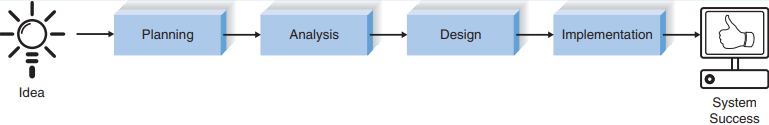

# Основные понятия и определения информационных систем
**Информационная система** это система обработки информации вместе со
связанными организационными ресурсами, такими как: человеческие,
технические и финансовые ресурсы, которая обеспечивает и распространяет
информацию.[^1]

**Система обработки информации:** одна или несколько систем и устройств
обработки данных, таких как офисное и коммуникационное оборудование,
которые выполняют обработку.[^1] 

**Система обработки данных:** один или несколько компьютеров,
периферийное оборудование и программное обеспечение, которые выполняют
обработку данных.[^1]

Построение информационной системы с использованием SDLC (systems
development life cycle, жизненный цикл разработки систем) следует набору
из четырех основных этапов: планирование, анализ, проектирование и
реализация (Рисунок 1).[^2]:

 

Рисунок 1 - Жизненный цикл разработки систем 

| Фаза         | Цель                                               | Ожидаемые результаты                                                                      | Шаги для достижения                                                                                                                                                     | Техническое решение                                                                                                                                                                                                                                                                                                                  | Результат                                                                                                                                          |
|:-------------|:---------------------------------------------------|:------------------------------------------------------------------------------------------|:------------------------------------------------------------------------------------------------------------------------------------------------------------------------|:-------------------------------------------------------------------------------------------------------------------------------------------------------------------------------------------------------------------------------------------------------------------------------------------------------------------------------------|:---------------------------------------------------------------------------------------------------------------------------------------------------|
| Планирование | Какое назначение системы? Какая структура проекта? | План проекта. Системный запрос с технико-экономическим обоснованием (техническое задание) | Определить имеющиеся возможности. Провести анализ выполнимости проекта. Разарботать план. Определить команду проекта.  Контроль за выполнением проекта. | Понимание проекта. Техническая, экономическая, организационная  осуществимость. Оценка времени. Определение задач. Структура работ. Диаграмма PERT. Диаграмма Ганта. Сферы управления. Кадровое обеспечение проекта. Устав проекта. CASE хранилище. Стандарты. Докумнетация. Ограничения по времени (Timeboxing). Управление рисками. | Функциональные требования.   Технико-экономическое обоснование. План работы. Штатное расписание.  Список стандартов. Оценка рисков. |
| Анализ       | Кто, что , где и когда нужно для системы?          | Проектное предложение                                                                     | Разработка стратегии анализа.  Определение потребностей бизнеса. Создание вариантов использования. Моделирование процессов.  Моделирование данных.          | Автоматизация бизнес-процессов. Совершенствование бизнес-процессов. Реинжиниринг бизнес-процессов. Интервью. JAD сессия. Опросник. Анализ документов. Наблюдение. Анализ вариантов использования. Построение диаграмм потоков данных. Моделирование отношений сущностей. Нормализация                                                | Определение требований.  Варианты использования. Модели процессов. Модель данных.                                                           |

[^1]:
    <a href ="https://www.iso.org/obp/ui/#iso:std:iso-iec:2382:ed-1:v1:en" >ISO/IEC 2382:2015 Information technology</a>
[^2]: http://www.saigontech.edu.vn/faculty/huynq/SAD/Systems_Analysis_Design_UML_5th%20ed.pdf