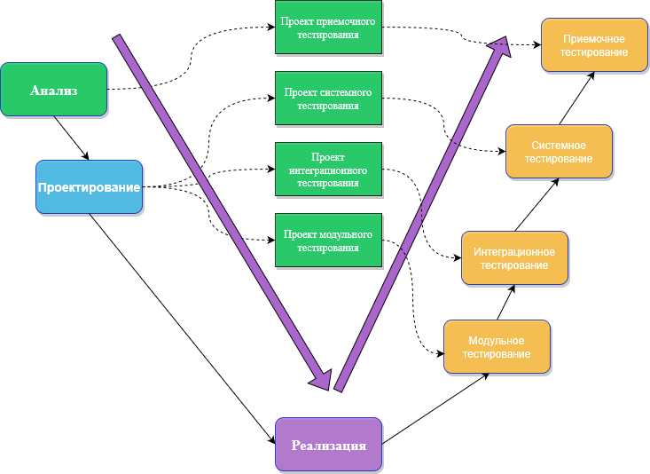
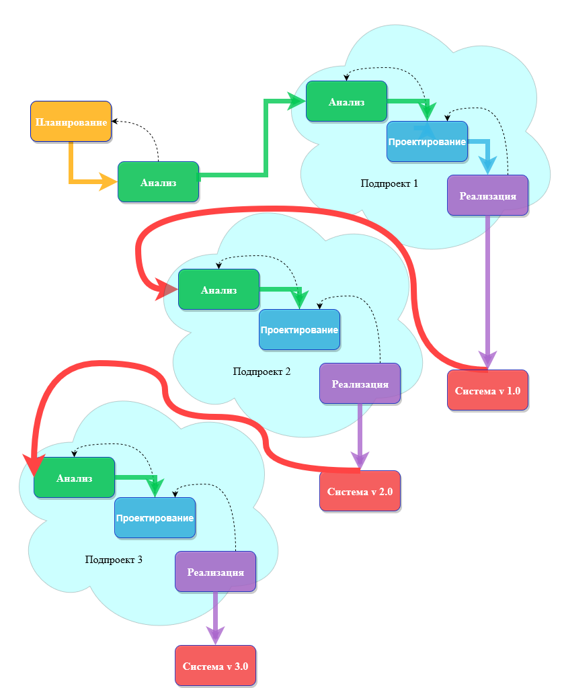
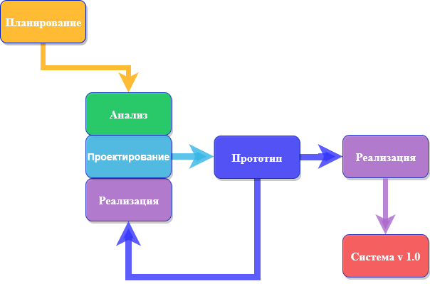
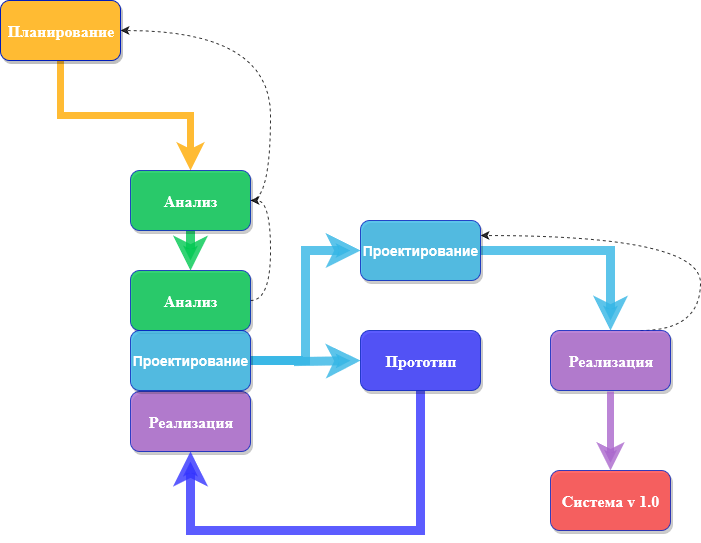
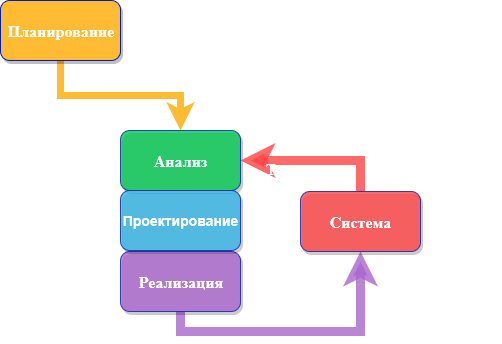

# Обзор методологий разработки систем

[Жизненный цикл разработки систем (SDLC)](../1_lecture/lecture.md)
обеспечивает основу для процессов, используемых для разработки
информационной системы.

Методология-это формализованный подход к реализации SDLC (т. е. это
список шагов и результатов).

Существует много различных методологий разработки систем, и они
различаются с точки зрения прогресса, который следует через этапы SDLC.
Некоторые методологии являются формальными стандартами, используемыми
государственными учреждениями, в то время как другие были разработаны
консалтинговыми фирмами для продажи клиентам.

Многие организации имеют свои собственные внутренние методологии,
которые были усовершенствованы на протяжении многих лет, и они точно
объясняют, как каждый этап SDLC должен выполняться в этой компании.
Рассмотрим некоторые из преобладающих методологий, которые развивались с
течением времени

## Waterfall (Каскадная модель)
При разработке по каскадной модели пользователи последовательно
переходят от одной фазы к другой (рисунок 2.1).

Рисунок 2.1 – Каскадная модель разработки

Как только работа произведенная в одном участке выполнена, участок
заканчивается и начинается следующая фаза. По мере того как проект прогрессирует от этапа к этапу, он
движется вперед так же, как водопад. Хотя вполне возможно вернуться назад
на всех этапах (например, от проектирования до анализа) это довольно сложно.

Методология разработки "waterfall" имеет преимущество идентификации
требований задолго до начала программирования и ограничивает изменения
 требований по мере реализации проекта.
 
Основной недостаток заключаются в том, что проект (дизайн) должен
быть полностью определен до начала программирования. Кроме того, 
результаты часто важные требования могут быть упущены ввиду 
большого количествадокументации. Пользователи могут забыть первоначальную
цель системы, так как между первоначальной идеей и фактической реализацией
проходит много времени.

Кроме того, в сегодняшней динамичной бизнес-среде система, отвечающая
существующим условиям окружающей среды на этапе анализа,
может потребовать значительной доработки, чтобы соответствовать окружающей среде при ее внедрении.
Эта переделка требует возврата к начальной фазе и внесения необходимых
 изменений через каждую из последующих фаз по очереди.
 
Есть два альтернативных варианта каскадной модели.
### Parallel development (Параллельного развития)
Методология **параллельного развития** (parallel development) эволюционировала с учетом длительных
сроков разработки по каскадной модели.
Как показано на рисунке 2.2, вместо последовательного проектирования и реализации
выполняется общий проект для всей системы.
Затем проект разбивается на ряд подпроектов,
которые могут быть разработаны и реализованы параллельно.
Как только все подпроекты завершены, происходит окончательная интеграция
отдельных частей, и система србирается.

Рисунок 2.1 – Модель параллельного развития

Параллельная разработка сокращает время, необходимое для создания
системы, поэтому изменения в бизнес-среде с меньшей вероятностью
приведут к необходимости ее доработки. Подход по-прежнему страдает от
проблем, вызванных объемными результатами. Это также добавляет новую
проблему: если подпроекты не являются полностью независимыми, проектные
решения в одном подпроекте могут повлиять на другой, и в конце проекта
интеграция подпроектов может быть довольно сложной задачей.

### V-model (V-образная модель)

V-образная модель представляет собой очередную вариацию каскадной
модели, которая обращает больше внимания на тестирование. Как показано
на рисунке 2.2, процесс разработки продолжается вниз по левому склону V,
определяя требования и проектируя компоненты системы.

Рисунок 2.2 – V-образная модель

В основании V модели написан код. На правой стороне модели с наклоном вверх проводятся
тестирование компонентов, интеграционное тестирование и, наконец,
приемо-сдаточное тестирование.
 
Ключевая концепция этой модели заключается в том, что по мере
определения требований и разработки компонентов также определяется
тестирование этих элементов. Таким образом, каждый уровень тестирования
четко связан с частью этапа анализа или проектирования, что помогает
обеспечить высокое качество и актуальность тестирования и
максимизировать эффективность тестирования.

## RAD (Rapid Application Development, Быстрая разработка приложений)
Быстрая разработка приложений представляет собой набор методологий,
которые появились в ответ на слабые стороны каскадной модели и его
вариации. RAD включает в себя специальные методы и компьютерные
инструменты для ускорения этапов анализа, проектирования и внедрения,
чтобы получить некоторую часть системы, разработанную быстро
пользователям для оценки и обратной связи. 

CASE[^1] (computer-aided software engineering) инструменты, JAD (joint
application development)[^2] сессии, [языки программирования четвертого
поколения](https://en.wikipedia.org/wiki/Fourth-generation_programming_language)
и генераторы кода могут применяться в RAD. В то время как RAD может
повысить скорость и качество разработки систем, он также может создать
проблему в управлении ожиданиями пользователей. Поскольку системы
разрабатываются быстрее и пользователи получают лучшее понимание
информационных технологий, ожидания пользователей могут значительно
увеличиться, а системные требования могут расшириться в ходе проекта
(иногда известный как ползучесть области ("scope creep") или ползучесть
функции( feature creep) ).

** Итеративная разработка (Iterative development)** разбивает общий
проект на ряд версий, которые разрабатываются последовательно. Наиболее
важные и фундаментальные требования включены в первую версию системы.
Эта версия быстро разрабатывается с помощью процесса мини-водопада, и
после внедрения пользователи могут обеспечить ценную обратную связь,
которая будет включена в следующую версию системы. (рисунок 2.3)
 
 

Рисунок 2.3 – Модель RAD

**Прототипирование системы (System prototyping)** выполняет этапы
анализа, проектирования и внедрения одновременно, чтобы быстро
разработать упрощенную версию предлагаемой системы и предоставить ее
пользователям для оценки и обратной связи. (См. Рис. 2.4)

 

Рисунок 2.4 – Прототипирование системы

Прототип системы является "быстрой и грязной" версией системы и
обеспечивает минимальные возможности. Следуя реакции и комментариям
пользователей, разработчики повторно анализируют, перепроектируют и
переопределяют второй прототип, который исправляет недостатки и
добавляет больше возможностей. Этот цикл продолжается до тех пор, пока
аналитики, пользователи и спонсор не согласятся с тем, что прототип
обеспечивает достаточную функциональность для установки и использования
в организации. Прототипирование системы очень быстро обеспечивает
отовность системы для пользователей и показывает прогресс проекта.

Этот подход очень полезен, когда пользователи испытывают трудности с
выражением требований к системе. Недостатком, однако, является
отсутствие тщательного, методического анализа до принятия проектных и
внедренческих решений. Прототипы систем могут иметь некоторые
фундаментальные конструктивные ограничения, которые являются прямым
результатом недостаточного понимания истинных требований системы на
ранних стадиях проекта.

**Одноразовое прототипирование (Быстрое прототипирование , Throwaway
prototyping)** включает в себя разработку прототипов, но использует
прототипы в первую очередь для изучения альтернативных вариантов
дизайна, а не в качестве фактической новой системы (как в
прототипировании системы). Как показано на рис. 2.5, одноразовое
прототипирование имеет довольно тщательный этап анализа, который
используется для сбора требований и разработки идей для концепции
системы. Однако многие функции, предлагаемые пользователями, могут быть
недостаточно поняты, и могут возникнуть сложные технические проблемы,
требующие решения. Каждый из этих вопросов рассматривается путем
анализа, проектирования и построения прототипа проекта. Прототип не
предназначен для того, чтобы быть рабочей системой. Он содержит только
достаточно подробностей, чтобы пользователи могли понять рассматриваемые
вопросы.

 

Рисунок 2.5 – Прототипирование системы

Например, предположим, что пользователи не совсем понимают, как должна
работать система ввода заказов. Команда аналитиков может построить серию
HTML-страниц для просмотра в веб-браузере, чтобы помочь пользователям
визуализировать такую систему. В этом случае серия макетных экранов
кажется системой, но на самом деле они ничего не делают. Или
предположим, что команде проекта необходимо разработать сложную
графическую программу на Java. Команда могла написать часть программы с
искусственными данными, чтобы гарантировать, что они смогут успешно
создать полноценную программу.

Система, которая разрабатывается с помощью этого типа методологии,
вероятно, требует нескольких прототипов дизайна на этапах анализа и
проектирования. Каждый из прототипов используется для минимизации риска,
связанного с системой, путем подтверждения того, что важные вопросы
поняты до построения реальной системы. После того, как вопросы решены,
проект переходит к разработке и реализации. На этом этапе прототипы
дизайна отбрасываются, что является важным отличием этого подхода от
прототипирования системы, в котором прототипы развиваются в конечную
систему.

Быстрое прототипирование уравновешивает преимущества хорошо
продуманных этапов анализа и проектирования с преимуществами
использования прототипов для уточнения ключевых вопросов до построения
системы. Создание окончательной системы может занять больше времени по
сравнению с прототипированием системы (поскольку прототипы не становятся
окончательной системой), но такой подход обычно приводит к созданию
более стабильных и надежных систем.

## Agile Development (Гибкая разработка)[^3]

Гибкая разработка представляет собой группу методологий, которые ориентированы на
упрощение процесса SDLC. Большая часть расходов по
моделированию и документированию устраняется; вместо этого
предпочтительнее общение лицом к лицу с заказчиком. Проект подчеркивает простую,
итеративную разработку приложений, в которой каждая итерация является
полным проектом программного обеспечения, включая планирование, анализ
требований, проектирование, кодирование, тестирование и документацию.
(См. Рисунок 2.6). 

 

Рисунок 2.6 – Прототипирование системы

Циклы длятся недолго (от одной до четырех недель), и
команда разработчиков сосредотачивается на адаптации к текущей
бизнес-среде. Существует несколько популярных подходов к гибкой
разработке, включая экстремальное программирование (XP) 8, Scrum и
метод разработки динамических систем (DSDM).

### Экстремальное программирование (extreme programming)

[^1]: Набор инструментов и методов программной инженерии для
проектирования программного обеспечения, который помогает обеспечить
высокое качество программ, отсутствие ошибок и простоту в обслуживании
программных продуктов, Kuhn, D. L. (1989) Selecting and effectively
using a computer aided software engineering tool. Annual Westinghouse
computer symposium; 6-7 Nov 1989; Pittsburgh, PA (USA); DOE Project.
[^2]: Совместное проектирование приложений (JAD) - это процесс,
используемый в области жизненного цикла метода разработки динамических
систем (DSDM) для сбора бизнес-требований при разработке новых
информационных систем для компании.JAD также включает подходы к
расширению участия пользователей, ускорению разработки и повышению
качества спецификаций."Он состоит из рабочих совещаний, где "эксперты и
ИТ-специалисты встречаются, иногда в течение нескольких дней, чтобы
определить и рассмотреть бизнес-требования к системе."  .Haag, Stephen;
Cummings, Maeve; McCubbrey, Donald J. (2006). "Phase 2: Analysis".
Information Management Systems for the Information Age. McGraw-Hill
Ryerson. ISBN 978-0-07-281947-2.
[^3]: [https://agilemanifesto.org/](https://agilemanifesto.org/)

 
 