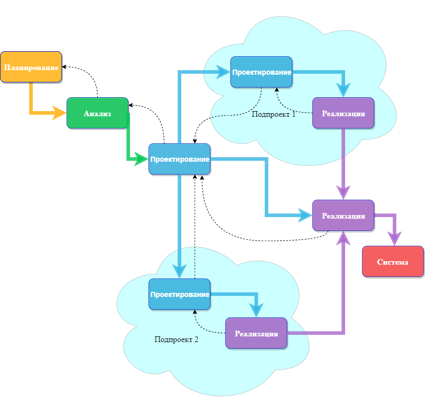

# Обзор методологий разработки систем

[Жизненный цикл разработки систем (SDLC)](../1_lecture/lecture.md)
обеспечивает основу для процессов, используемых для разработки
информационной системы.

Методология-это формализованный подход к реализации SDLC (т. е. это
список шагов и результатов).

Существует много различных методологий разработки систем, и они
различаются с точки зрения прогресса, который следует через этапы SDLC.
Некоторые методологии являются формальными стандартами, используемыми
государственными учреждениями, в то время как другие были разработаны
консалтинговыми фирмами для продажи клиентам.

Многие организации имеют свои собственные внутренние методологии,
которые были усовершенствованы на протяжении многих лет, и они точно
объясняют, как каждый этап SDLC должен выполняться в этой компании.
Рассмотрим некоторые из преобладающих методологий, которые развивались с
течением времени

## Waterfall (Каскадная модель)
При разработке по каскадной модели пользователи последовательно
переходят от одной фазы к другой (рисунок 2.1).

Рисунок 2.1 – Каскадная модель разработки

Как только работа произведенная в одном участке выполнена, участок
заканчивается и начинается следующая фаза. По мере того как проект прогрессирует от этапа к этапу, он
движется вперед так же, как водопад. Хотя вполне возможно вернуться назад
на всех этапах (например, от проектирования до анализа) это довольно сложно.

Методология разработки "waterfall" имеет преимущество идентификации
требований задолго до начала программирования и ограничивает изменения
 требований по мере реализации проекта.
 
Основной недостаток заключаются в том, что проект (дизайн) должен
быть полностью определен до начала программирования. Кроме того, 
результаты часто важные требования могут быть упущены ввиду 
большого количествадокументации. Пользователи могут забыть первоначальную
цель системы, так как между первоначальной идеей и фактической реализацией
проходит много времени.

Кроме того, в сегодняшней динамичной бизнес-среде система, отвечающая
существующим условиям окружающей среды на этапе анализа,
может потребовать значительной доработки, чтобы соответствовать окружающей среде при ее внедрении.
Эта переделка требует возврата к начальной фазе и внесения необходимых
 изменений через каждую из последующих фаз по очереди.
 
Есть два альтернативных варианта каскадной модели.
### Parallel development (Параллельного развития)
Методология **параллельного развития** (parallel development) эволюционировала с учетом длительных
сроков разработки по каскадной модели.
Как показано на рисунке 2.2, вместо последовательного проектирования и реализации
выполняется общий проект для всей системы.
Затем проект разбивается на ряд подпроектов,
которые могут быть разработаны и реализованы параллельно.
Как только все подпроекты завершены, происходит окончательная интеграция
отдельных частей, и система србирается.

Рисунок 2.1 – Модель параллельного развития

 
 